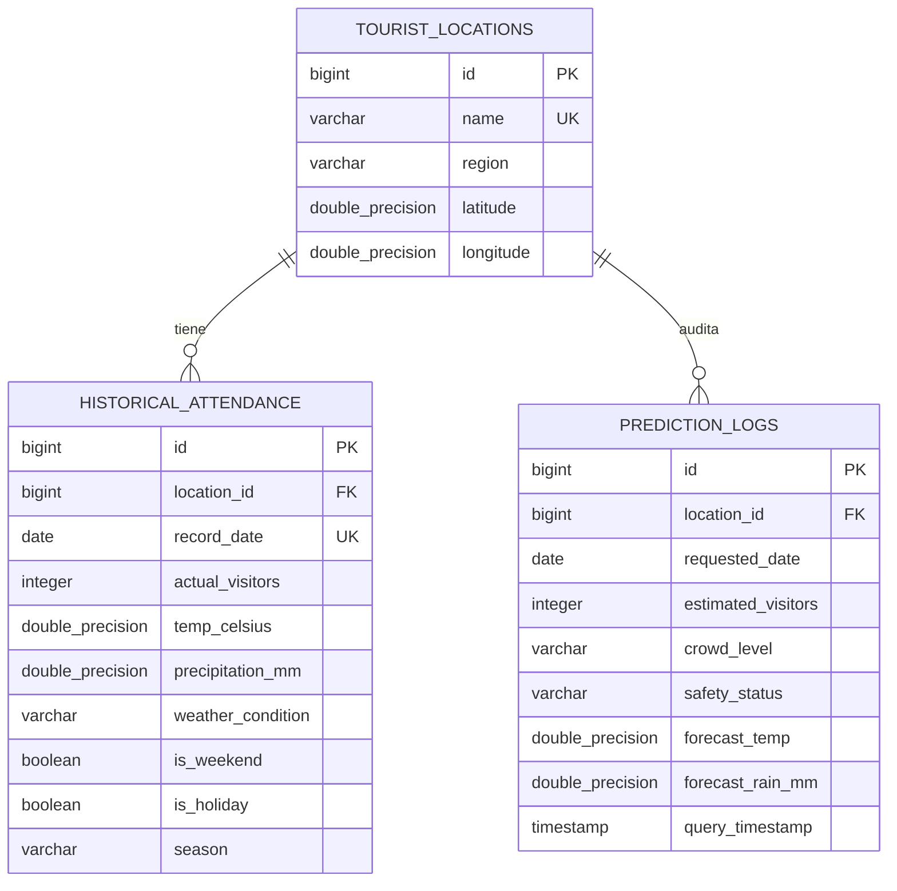

# Spec Database 01: Arquitectura y Scripts de Base de Datos Supabase (PostgreSQL)

## 1. Conexión y Configuración en Supabase

El Backend Java Spring Boot se conecta a Supabase mediante JDBC PostgreSQL usando Spring Data JPA / Hibernate:

- **Host Supabase:** `db.[PROJECT_REF].supabase.co`
- **Puerto:** `5432` / `6543` (Transaction Pooler)
- **Database:** `postgres`
- **Driver Java:** `org.postgresql.Driver`
- **Ubicación de Scripts SQL:** En la raíz de tu proyecto en la carpeta **[`db/`](file:///c:/Users/ThikPad/Desktop/MESE%20VIII/DESARROLLO%20DE%20APLICACIONES%20PARA%20LA%20NUBE/parcial_1/db)**.

---

## 2. Organización de Scripts SQL (`/db`)

```
parcial_1/db/
├── 01_schema.sql          # Creación de Tablas, Claves Foráneas, Índices y RLS (Row Level Security)
├── 02_seeder.sql          # Dataset histórico avanzado para Catarata Derrepente
└── 03_views_analytics.sql # Vistas analíticas para Dashboard en Supabase
```

---

## 3. Modelo Entidad-Relación y Tablas



---

## 4. Descripción de Scripts

### A. [`db/01_schema.sql`](file:///c:/Users/ThikPad/Desktop/MESE%20VIII/DESARROLLO%20DE%20APLICACIONES%20PARA%20LA%20NUBE/parcial_1/db/01_schema.sql)
- Crea las extensiones como `uuid-ossp`.
- Crea la tabla de destinos turísticos `tourist_locations` (sembrando por defecto Catarata Derrepente).
- Crea la tabla `historical_attendance` con restricciones `CHECK` para impedir valores negativos en visitantes o lluvia.
- Crea la tabla de auditoría `prediction_logs`.
- Habilita las políticas **Row Level Security (RLS)** de Supabase para permitir consultas públicas seguras y escritura desde la API.

### B. [`db/02_seeder.sql`](file:///c:/Users/ThikPad/Desktop/MESE%20VIII/DESARROLLO%20DE%20APLICACIONES%20PARA%20LA%20NUBE/parcial_1/db/02_seeder.sql)
- Inserta más de 30 registros históricos reales de días soleados, lluvias ligeras, tormentas tropicales, fines de semana y feriados como Santa Rosa de Lima en Tingo María.

### C. [`db/03_views_analytics.sql`](file:///c:/Users/ThikPad/Desktop/MESE%20VIII/DESARROLLO%20DE%20APLICACIONES%20PARA%20LA%20NUBE/parcial_1/db/03_views_analytics.sql)
- Proporciona las vistas `v_monthly_tourist_summary`, `v_weather_impact_analysis` y `v_recent_predictions_summary` para ser consumidas o visualizadas en el Dashboard de Supabase.
